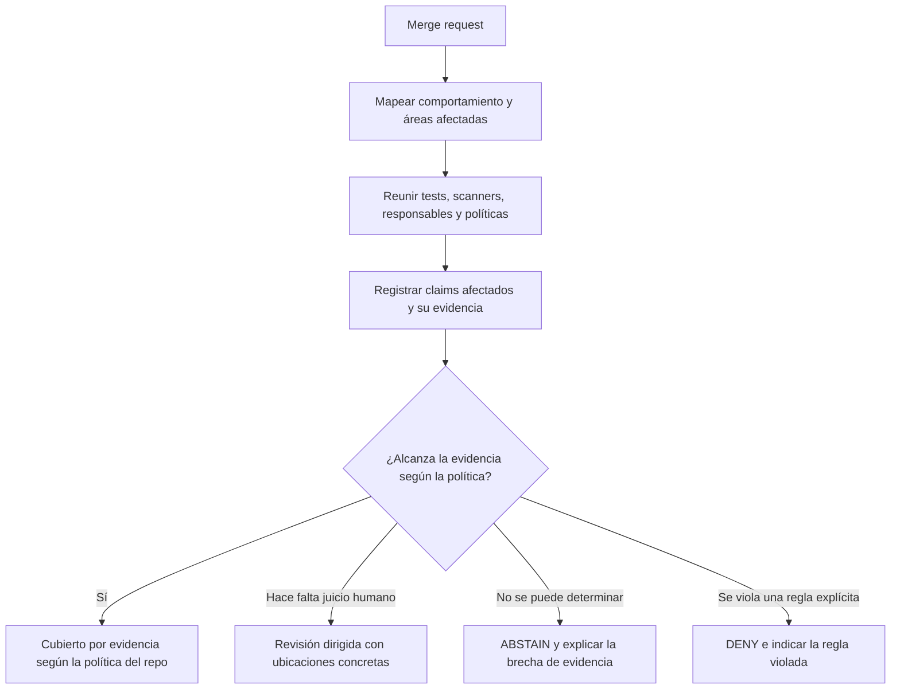
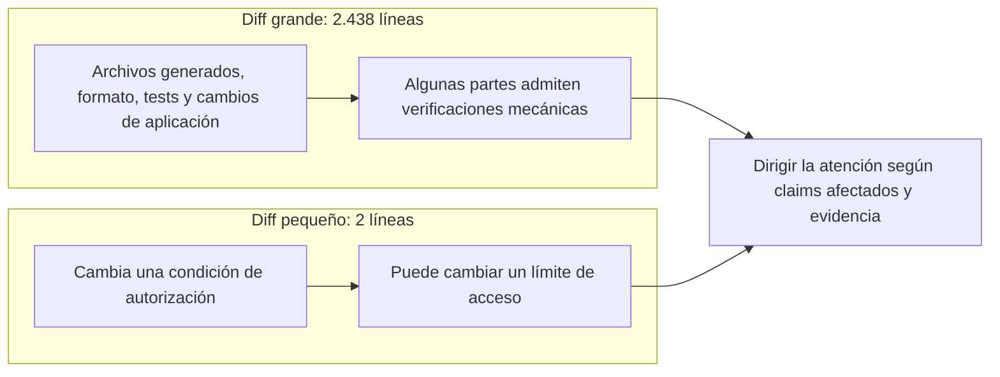
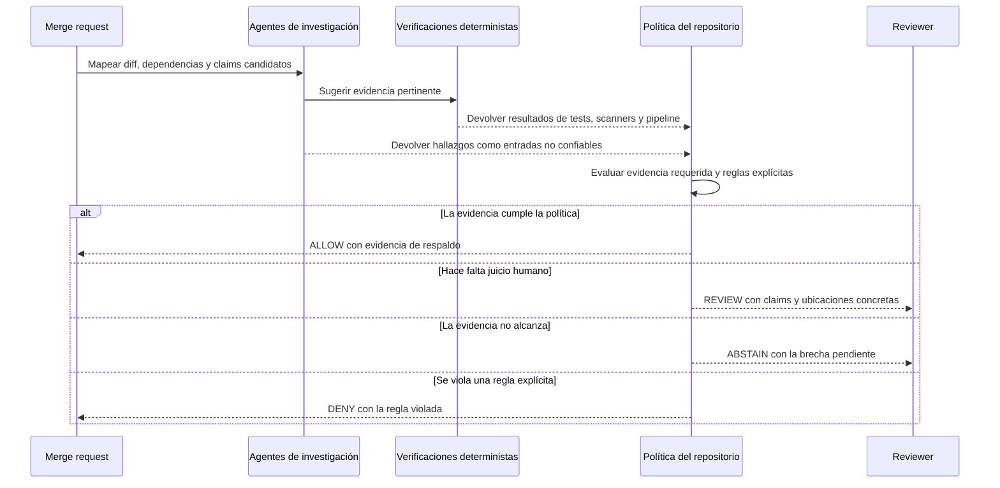
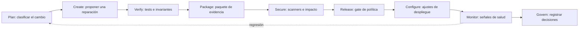
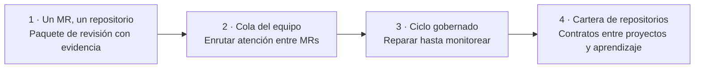

# TO BUILD A FIRE

[English](README.md) · [Español](README.es.md) · [README técnico](TECHNICAL_README.md)

**La IA abarató la generación de código. La atención humana sigue siendo escasa.**

Cuando las personas y los agentes de programación pueden abrir más merge requests de las que un equipo alcanza a inspeccionar con cuidado, sumar otra corriente de comentarios automáticos puede agrandar la cola. TO BUILD A FIRE es una idea de producto para dirigir el esfuerzo de revisión: reunir evidencia sobre un cambio, identificar qué sigue sin resolverse e indicar dónde hace falta el juicio humano.

> **Estado del proyecto:** concepto y planificación para un hackathon. Este repositorio todavía no contiene una implementación ni resultados medidos.

## El problema

La cantidad de cambios propuestos puede crecer más rápido que la capacidad humana para revisarlos. El tamaño del diff es una guía pobre: un lockfile generado puede ocupar cientos de líneas, mientras que un cambio de dos líneas en autorización puede alterar quién accede a datos sensibles.

Enviar cada cambio a otro revisor de IA puede dejar al reviewer con el diff original y más comentarios, resúmenes y hallazgos para evaluar. Los equipos necesitan ver qué cambió, qué propiedades importantes pudieron verse afectadas, qué evidencia existe y qué requiere todavía a una persona.

## Qué hace

TO BUILD A FIRE es un **enrutador de atención para merge requests**. La idea es armar un paquete de evidencia que ayude al reviewer a decidir dónde invertir tiempo. No toma la confianza de un agente ni un único puntaje de riesgo como prueba.

Los resultados propuestos son estados explicables, no un puntaje que oculte sus motivos:

| Resultado | Significado |
| --- | --- |
| `ALLOW` | Los claims requeridos tienen la evidencia exigida por la política del repositorio. |
| `REVIEW` | La política o las consecuencias pendientes requieren juicio humano. |
| `ABSTAIN` | La evidencia disponible no alcanza para tomar una decisión respaldada. |
| `DENY` | El cambio viola una regla explícita, como modificar una política protegida. |

Son semánticas propuestas; todavía no existe un motor de decisión.

## Una distinción útil

Comparemos dos cambios:

La cantidad de líneas ayuda a describir el diff, pero no determina cuánto hay que revisarlo. El sistema debería informar por separado la **superficie cubierta por evidencia** y la **superficie pendiente de revisión**. No debe llamar seguro a un fragmento que no necesita revisión humana sólo porque fue resumido o clasificado como mecánico.

## Qué diferencia a este enfoque

| Cola de revisión típica | TO BUILD A FIRE (propuesto) |
| --- | --- |
| Ordenar por tamaño, etiquetas o un puntaje único | Explicar la atención necesaria con claims afectados, política y evidencia |
| Acumular comentarios automáticos para que una persona los lea | Reunir evidencia primero y señalar lo que sigue sin resolverse |
| Tomar un scanner limpio o un pipeline verde como señal general | Decir qué verificaciones pasaron y qué claims respaldan |
| Preguntarle a un agente si el cambio parece seguro | Usar agentes para investigar; usar política y evidencia explícitas para decidir el enrutamiento |

## Comportamiento esperado

El paquete de un MR debería explicar qué cambió, qué claims protegidos podrían verse afectados, qué verificaciones se ejecutaron, qué establecen, qué incertidumbre queda y dónde mirar. Si la evidencia no permite decidir, el sistema debería decirlo y abstenerse.

## Dirección para el hackathon

La demo prevista contrasta un cambio grande, mayormente generado, con un cambio mínimo de autorización. Debería mostrar cómo la evidencia y los claims protegidos afectan el enrutamiento, sin afirmar que el sistema ya redujo el tiempo de revisión.

El concepto se conecta con el ciclo post-código del hackathon GitLab Transcend:

Estas etapas describen el rumbo previsto, no integraciones terminadas. El uso de GitLab Duo Agent Platform es un requisito del hackathon y todavía falta implementarlo.

## Mapa del repositorio

- `README.md` — descripción del proyecto y comportamiento esperado.
- `README.es.md` — versión en español de la descripción.
- `TECHNICAL_README.md` — arquitectura propuesta, límites de decisión, modelo de evidencia y preguntas abiertas.
- `LICENSE` — licencia MIT, copyright © 2026 Anna Tchijova.

## Próximos pasos

El producto se plantea como niveles completos y conectados. Cada nivel sirve por sí mismo y conserva los límites de evidencia, política y autoridad que necesita el sistema final. Los niveles describen el destino y un camino de construcción; no afirman que este repositorio ya los implemente.

| Nivel | Estado completo y útil |
| --- | --- |
| **1. Paquete de MR respaldado por evidencia** | Un reviewer puede usar el sistema con un merge request real de un repositorio. Mapea el cambio a claims declarados, ejecuta y registra verificaciones con alcance explícito, y produce `REVIEW`, `ABSTAIN` o un resultado respaldado por política, con evidencia y ubicaciones precisas. Los agentes de GitLab Duo investigan; un evaluador determinista de políticas decide el enrutamiento. |
| **2. Cola de atención del equipo** | El equipo puede ordenar varios MRs abiertos según consecuencias sin resolver, experiencia requerida y capacidad de revisión declarada. Las políticas y responsables del repositorio guían el enrutamiento; los reviewers pueden corregir el paquete y registrar qué necesitó su atención. |
| **3. Ciclo de cambio gobernado** | El sistema puede proponer reparaciones acotadas, verificarlas, armar evidencia, aplicar gates explícitos de release, trasladar políticas a la configuración y observar señales posteriores al despliegue. Las aprobaciones humanas y acciones permitidas a agentes son explícitas; las regresiones reabren el ciclo de evidencia y revisión. |
| **4. Cartera de repositorios** | Los equipos pueden aplicar políticas compatibles a repositorios relacionados, contemplar contratos y dependencias entre proyectos, y comparar esfuerzo y resultados medidos de revisión. Cualquier ajuste sigue siendo explicable y no puede debilitar en silencio la evidencia o política requerida. |

El destino completo es un sistema de atención que contempla una cartera de repositorios, sigue el cambio desde su propuesta hasta la evidencia posterior al despliegue, dirige el juicio humano a claims consecuentes aún sin resolver y registra por qué cada acción fue permitida, enrutada o detenida. El plazo del hackathon modifica cuántos niveles se intentan; no cambia el criterio de finalización ni vuelve descartable un nivel incompleto. El [README técnico](TECHNICAL_README.md#destination-and-build-levels) detalla los límites de cada nivel, la evidencia de finalización y los invariantes que se heredan desde el primero.

El lenguaje de implementación elegido es Python. El proyecto usa la licencia MIT; ver [LICENSE](LICENSE).
