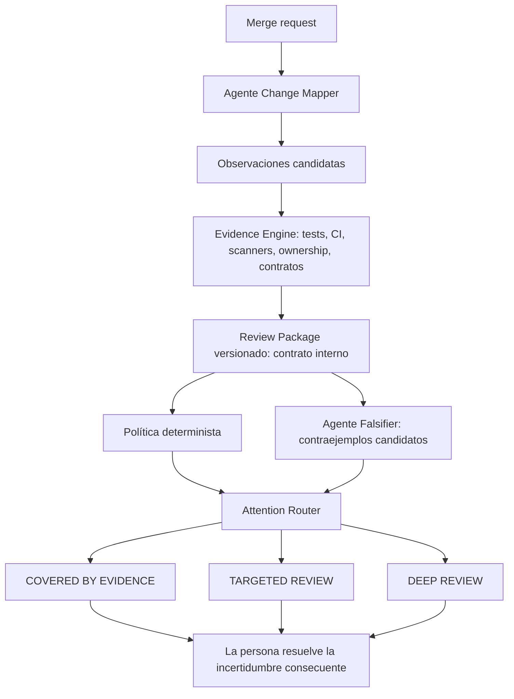
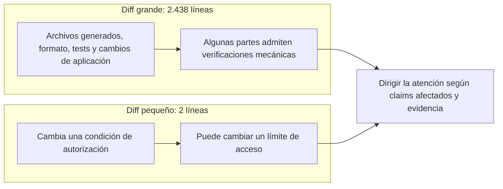
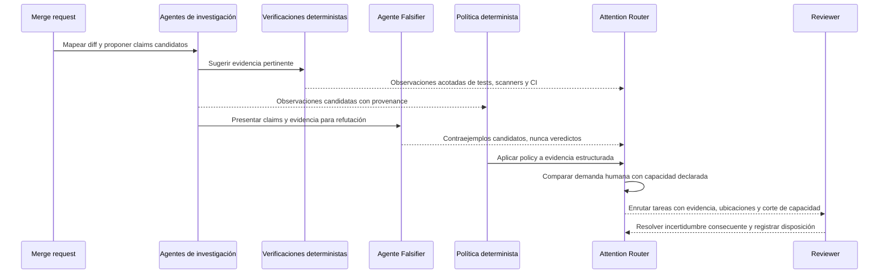
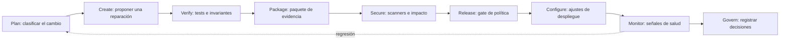
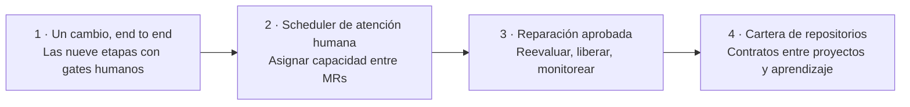

# TO BUILD A FIRE

[English](README.md) · [Español](README.es.md) · [README técnico](TECHNICAL_README.md)


Cuando las personas y los agentes de programación pueden abrir más merge requests de las que un equipo alcanza a inspeccionar con cuidado, sumar otra corriente de comentarios automáticos puede agrandar la cola. TO BUILD A FIRE es una idea de producto para dirigir el esfuerzo de revisión: reunir evidencia sobre un cambio, identificar qué sigue sin resolverse e indicar dónde hace falta el juicio humano.

> **Estado del proyecto:** existen el router local, las verificaciones del proyecto y un job de GitLab CI que emite un Review Package de ejemplo; todavía no vimos ejecutarse ese pipeline en GitLab. El recibo usa datos ilustrativos: no evalúa el MR del pipeline. La automatización end to end con Duo, evidencia de un MR real, aprobaciones protegidas, despliegue a Cloud Run y monitoreo son el objetivo del Nivel 1 Path B/Assisted, no funciones terminadas. Ver [`docs/hackathon-path-b.md`](docs/hackathon-path-b.md).

## El problema

La cantidad de cambios propuestos puede crecer más rápido que la capacidad humana para revisarlos. El tamaño del diff es una guía pobre: un lockfile generado puede ocupar cientos de líneas, mientras que un cambio de dos líneas en autorización puede alterar quién accede a datos sensibles.

Enviar cada cambio a otro revisor de IA puede dejar al reviewer con el diff original y más comentarios, resúmenes y hallazgos para evaluar. Los equipos necesitan ver qué cambió, qué propiedades importantes pudieron verse afectadas, qué evidencia existe y qué requiere todavía a una persona.

## Qué hace

TO BUILD A FIRE es un **enrutador de atención para merge requests**. Asigna la capacidad humana finita a los cambios donde sigue habiendo incertidumbre consecuente, y muestra motivos, ubicaciones, minutos demandados y trabajo que queda fuera de la capacidad. Un `Review Package` versionado es el contrato interno que transporta evidencia entre componentes; no es el producto. El sistema no toma la confianza de un agente ni un puntaje único de riesgo como prueba.

**Los agentes producen observaciones. La verificación produce evidencia acotada. La policy enruta atención. Las personas resuelven lo que sigue siendo consecuente e incierto.**



El router tiene tres rutas de atención explicables:

| Ruta | Significado |
| --- | --- |
| `COVERED_BY_EVIDENCE` | Los claims declarados tienen la evidencia requerida por la política indicada. No significa “seguro” ni autoriza un merge. |
| `TARGETED_REVIEW` | Hay claims consecuentes cuya incertidumbre persiste; el router señala claims, brechas de evidencia y ubicaciones concretas. |
| `DEEP_REVIEW` | El impacto es amplio, contradictorio o demasiado incierto para una revisión acotada; una persona debe evaluar el cambio en profundidad. |

Estados como `SUPPORTED`, `UNRESOLVED`, `CONTRADICTED` y `NOT_RUN` describen qué establecieron las verificaciones. Son distintos de las rutas de atención. Los gates explícitos de merge o release son una decisión de política aparte. El motor local exige alcance declarado y verificaciones para el SHA exacto. GitLab CI está configurado para ejecutar las verificaciones del proyecto, pero aún no consume evidencia de un MR real ni funciona como gate confiable de decisión.

## Una distinción útil

Comparemos dos cambios:



La cantidad de líneas ayuda a describir el diff, pero no determina cuánto hay que revisarlo. El sistema debería informar por separado la **superficie cubierta por evidencia** y la **superficie pendiente de revisión**. No debe llamar seguro a un fragmento que no necesita revisión humana sólo porque fue resumido o clasificado como mecánico.

## Qué diferencia a este enfoque

| Cola de revisión típica | TO BUILD A FIRE (propuesto) |
| --- | --- |
| Ordenar por tamaño, etiquetas o un puntaje único | Explicar la atención necesaria con claims afectados, política y evidencia |
| Acumular comentarios automáticos para que una persona los lea | Reunir evidencia primero y señalar lo que sigue sin resolverse |
| Tomar un scanner limpio o un pipeline verde como señal general | Decir qué verificaciones pasaron y qué claims respaldan |
| Preguntarle a un agente si el cambio parece seguro | Usar agentes para investigar; usar política y evidencia explícitas para decidir el enrutamiento |

## Comportamiento esperado

El Attention Router debería indicar cuánta revisión humana se necesita, cuánta capacidad hay, qué queda fuera de esa capacidad y por qué. Cada tarea enlaza a los claims afectados, ubicaciones, evidencia y sus límites, política y origen del cálculo de tiempo. Si la estimación no tiene respaldo, la demanda es `UNKNOWN`, nunca cero. Los claims candidatos de los agentes siguen siendo candidatos hasta ser corroborados o adjudicados.

Por ejemplo, un equipo con 180 minutos de revisión y una demanda estimada de 267 vería 180 minutos asignados y 87 todavía sin cubrir. “Asignado” describe el uso de capacidad; no significa que el código esté cubierto por evidencia ni que sea seguro. Las cifras ilustran la vista deseada y no son resultados medidos del proyecto.

```text
Capacidad de revisión hoy: 180 min
Demanda estimada:          267 min
Asignado:                  180 min
Todavía sin cubrir:         87 min

Dentro de capacidad              Aún necesita atención
MR !82   auth       35 min        MR !109  auth       42 min
MR !91   payments   50 min        MR !114  payments   45 min
MR !77   infra      40 min
MR !103  API        25 min
MR !66   deps       30 min
                         ───                            ───
                         180                             87 min
```



## Dirección para el hackathon

La evaluación prevista usa cambios sembrados y controles benignos: diffs generados, actualizaciones de dependencias, refactors sólo de formato, tests faltantes, ampliación de autorización en dos líneas, scanners eliminados, assertions debilitadas, umbral de coverage reducido y comandos de CI que terminan en `|| true`. El inventario inicial está en [`evaluation/corpus.json`](evaluation/corpus.json), con comprobaciones ejecutables del contrato en `tests/`. Mide casos críticos enviados a personas, escalaciones benignas innecesarias, minutos humanos frente a una línea base declarada y conclusiones no respaldadas. El objetivo para promociones de candidatos sin evidencia es cero; todavía no hay métricas del producto.

La demo prevista contrasta un cambio grande, mayormente generado, con un cambio mínimo de autorización y luego muestra la demanda de atención frente a la capacidad del equipo. Debería mostrar cómo la evidencia y los claims protegidos afectan el enrutamiento, sin afirmar que el sistema ya redujo el tiempo de revisión.

El concepto se conecta con el ciclo post-código del hackathon GitLab Transcend:



El objetivo es que un mismo recorrido de MR atraviese las nueve etapas con evidencia observable. La [matriz Path B / Assisted](docs/hackathon-path-b.md#nine-stage-coverage-contract) define qué prueba necesita cada etapa; todavía no afirma que las integraciones estén ejecutándose.

## Mapa del repositorio

- `README.md` — descripción del proyecto y comportamiento esperado.
- `README.es.md` — versión en español de la descripción.
- `TECHNICAL_README.md` — arquitectura propuesta, límites de decisión, modelo de evidencia y preguntas abiertas.
- `TODO.md` — destino completo, niveles de construcción, invariantes y criterios de cierre.
- `docs/hackathon-path-b.md` — contrato Path B/Assisted end to end, evidencia por etapa, permisos requeridos y entregables del hackathon.
- `.gitlab/duo/flows/attention-review.yml` — primer flow de mapeo de MR; el mapper es de sólo lectura y una acción determinista publica la nota interna sólo tras aprobación humana. Falta validarlo y ejecutarlo en GitLab.
- `.gitlab-ci.yml` — job actual de verificaciones locales del proyecto; todavía no es un flow Duo ni un gate de merge/deploy.
- `.gitignore` — entornos locales de Python, cachés, artefactos de build y secretos.
- `visual/` — banner del proyecto y futuros recursos gráficos.
- `docs/red-team/` — revisiones adversariales de diseño y su evidencia.
- `LICENSE` — licencia MIT, copyright © 2026 Anna Tchijova.

## Próximos pasos

El producto se plantea como niveles completos y conectados. Cada nivel sirve por sí mismo y conserva los límites de evidencia, política y autoridad que necesita el sistema final. Los niveles describen el destino y un camino de construcción; no afirman que este repositorio ya los implemente.



| Nivel | Estado completo y útil |
| --- | --- |
| **1. Un cambio, end to end** | Recorrer las nueve etapas post-code con un MR real de GitLab, GitLab Duo, evidencia acotada, checkpoints humanos, release protegido, despliegue en Cloud Run y monitoreo. |
| **2. Scheduler de atención humana del equipo** | Asignar el presupuesto de revisión entre MRs, mostrar el corte de capacidad y el trabajo consecuente que sigue sin revisar. |
| **3. Reparación aprobada y reevaluación** | Una reparación acotada crea una revisión separada con evidencia nueva, gates de release/deploy y monitoreo enlazados a la decisión original. |
| **4. Cartera de repositorios** | Los equipos pueden aplicar políticas compatibles a repositorios relacionados, contemplar contratos y dependencias entre proyectos, y comparar esfuerzo y resultados medidos de revisión. Cualquier ajuste sigue siendo explicable y no puede debilitar en silencio la evidencia o política requerida. |

El destino completo es un sistema de atención que contempla una cartera de repositorios, sigue el cambio desde su propuesta hasta la evidencia posterior al despliegue, dirige el juicio humano a claims consecuentes aún sin resolver y registra por qué cada acción fue permitida, enrutada o detenida. El plazo del hackathon modifica cuántos niveles se intentan; no cambia el criterio de finalización ni vuelve descartable un nivel incompleto. El [README técnico](TECHNICAL_README.md#destination-and-build-levels) detalla los límites de cada nivel, la evidencia de finalización y los invariantes que se heredan desde el primero.

El lenguaje de implementación elegido es Python. El proyecto usa la licencia MIT; ver [LICENSE](LICENSE).

### Motor local de atención

La CLI acepta un registro JSON no confiable y acotado `tbaf.review-input/v1` y un archivo separado `tbaf.policy/v1`, y emite un recibo interno determinista, identificado por SHA-256. Los archivos modificados fuera del alcance de claims declarados y los candidatos obsoletos se enrutan a revisión profunda. Las observaciones candidatas no pueden despejar claims incluidos por policy; las verificaciones requeridas deben estar reportadas como exitosas para el SHA exacto del head. El esfuerzo desconocido permanece desconocido. La policy debe venir de una ubicación confiable y protegida; la CLI todavía no autentica quién produjo cada verificación ni su artefacto, así que el recibo sólo evalúa los registros recibidos.

```bash
python -m pip install -e .
tbaf-route examples/review-input.json --policy examples/policy.json
```

Este contrato local inicial cubre un MR; todavía no es una integración con GitLab, un gate de merge, un veredicto de seguridad ni una medición de reducción del tiempo de revisión.
El [plan de construcción](TODO.md) detalla los niveles y sus criterios de cierre.
