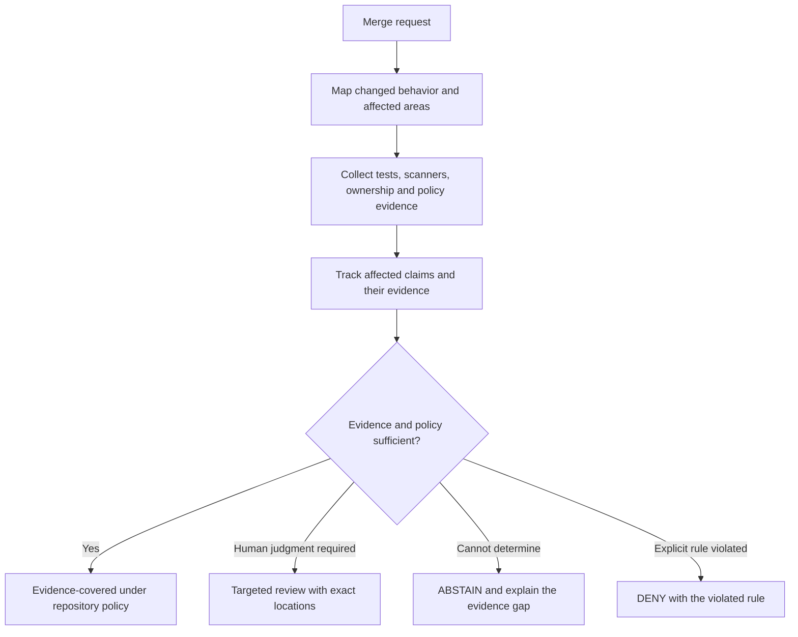
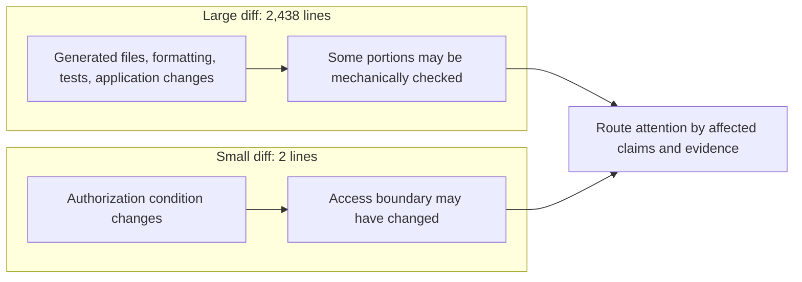
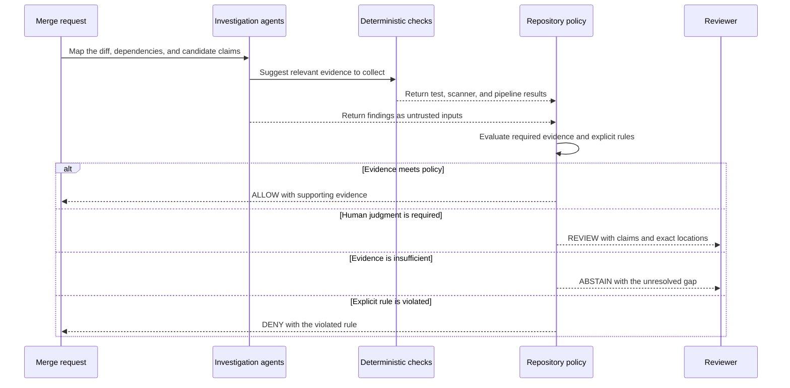
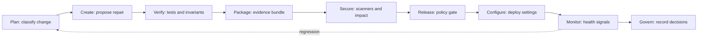
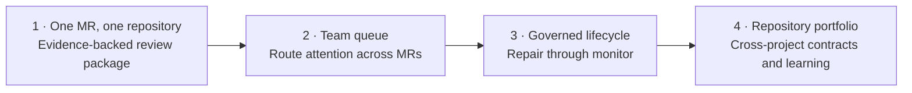

# TO BUILD A FIRE

[English](README.md) · [Español](README.es.md) · [Technical README](TECHNICAL_README.md)

**AI made code generation cheap. Human attention is still scarce.**

When people and coding agents can open more merge requests than a team can carefully inspect, another stream of automated review comments can add to the queue. TO BUILD A FIRE is a project idea for directing review effort: gather evidence about a change, identify what remains unresolved, and show people where their judgment matters most.

> **Project status:** concept and hackathon planning. This repository does not yet contain an implementation or measured results.

## The problem

The number of proposed changes can grow faster than human review capacity. Diff size alone is a poor guide: a generated lockfile may span hundreds of lines, while a two-line authorization change may alter who can access sensitive data.

Sending every change to another AI reviewer can leave reviewers with the original diff plus more comments, summaries, and findings to assess. Teams need a way to see what changed, which important properties may have been affected, what evidence exists, and what still needs a person.

## What it does

TO BUILD A FIRE is an **attention router for merge requests**. It is intended to assemble an evidence package that helps a reviewer decide where to spend time. It does not treat an agent's confidence or a single risk score as proof.

The intended outcomes are explainable states, not a score that hides its reasons:

| Outcome | Meaning |
| --- | --- |
| `ALLOW` | Required claims have the evidence required by the repository's policy. |
| `REVIEW` | Policy or unresolved consequences call for human judgment. |
| `ABSTAIN` | Available evidence is insufficient to reach a supported decision. |
| `DENY` | The change violates an explicit rule, such as altering protected policy. |

These are proposed product semantics; no decision engine exists yet.

## A useful distinction

Consider two changes:

Line counts can help describe the diff, but they do not establish how much review it needs. The system should report **evidence-covered surface** and **unresolved review surface** separately. A portion that is not currently flagged for human review must not be described as safe merely because it was summarized or classified as mechanical.

## What makes the approach different

| Typical review queue | TO BUILD A FIRE (proposed) |
| --- | --- |
| Sort or prioritize by diff size, labels, or a single score | Explain attention needs through affected claims, policy, and evidence |
| Aggregate automated comments for a person to read | Gather evidence first and point to unresolved locations |
| Treat a clean scan or passing pipeline as a broad signal | State exactly which checks passed and which claims they support |
| Ask an agent whether the change looks safe | Use agents to investigate; use explicit policy and evidence to route decisions |

## How it should behave

An MR package should tell a reviewer what changed, which protected claims may be affected, what checks ran, what they establish, what remains uncertain, and where to look. If the available evidence does not support a decision, the system should say so and abstain.

## Hackathon direction

The planned demonstration contrasts a large, mostly generated change with a tiny authorization change. It should show how evidence and protected claims affect routing, rather than claim that the system has already reduced review time.

The concept maps to the post-code lifecycle the GitLab Transcend hackathon asks participants to explore:

These stages describe the intended direction, not completed integrations. GitLab Duo Agent Platform use is a hackathon requirement and remains to be implemented.

## Repository map

- `README.md` — project overview and intended behavior.
- `README.es.md` — Spanish version of the overview.
- `TECHNICAL_README.md` — proposed architecture, decision boundary, evidence model, and open questions.
- `LICENSE` — MIT License, copyright © 2026 Anna Tchijova.

## Next steps

The product is planned as a set of complete, connected levels. Each level is useful on its own and keeps the evidence, policy, and authority boundaries needed by the full system. The levels below describe the destination and a build path toward it; they are not claims about what this repository already implements.

| Level | Complete, useful state |
| --- | --- |
| **1. Evidence-backed MR package** | A reviewer can use the system on a real merge request in one repository. It maps a change to declared claims, runs and records scoped checks, then produces `REVIEW`, `ABSTAIN`, or a policy-supported result with exact evidence and locations. GitLab Duo agents investigate; a deterministic policy evaluator owns the routing decision. |
| **2. Team attention queue** | A team can see and order multiple open MRs by unresolved consequence, required expertise, and declared review capacity. Repository policies and ownership guide routing; reviewers can correct the package and record what required their attention. |
| **3. Governed change lifecycle** | The system can propose bounded repairs, verify them, package evidence, apply explicit release gates, carry policy into configuration, and watch post-deploy signals. Human approvals and permitted agent actions are explicit; regressions reopen the evidence and review loop. |
| **4. Repository portfolio** | Teams can apply compatible policies across related repositories, account for cross-project contracts and dependencies, and compare measured review effort and outcomes. Any tuning remains explainable and cannot silently weaken required evidence or policy. |

The complete destination is a portfolio-aware attention system that follows a change from proposal through post-deploy evidence, directs human judgment to unresolved consequential claims, and records why each action was allowed, routed, or stopped. A hackathon deadline changes how many levels we attempt; it does not change the completion bar or make an unfinished level disposable. See the [Technical README](TECHNICAL_README.md#destination-and-build-levels) for level boundaries, completion evidence, and invariants inherited from the first level.

The implementation language is Python. The project is licensed under the MIT License; see [LICENSE](LICENSE).
