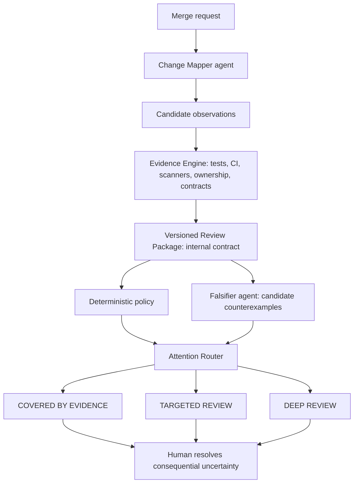
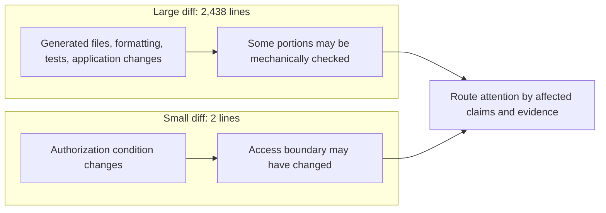
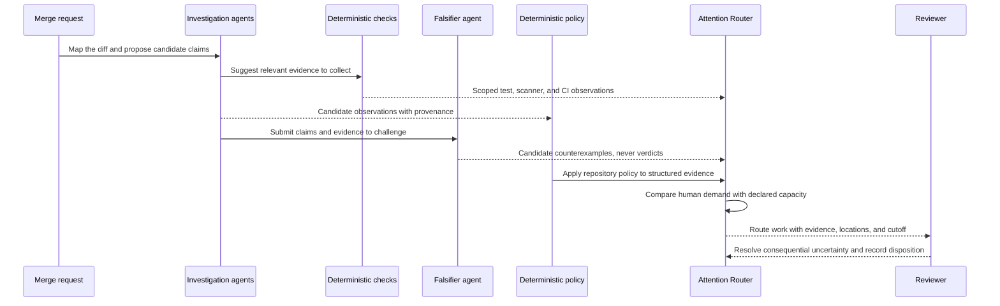
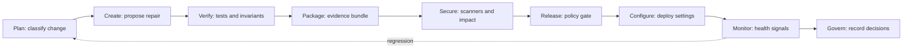
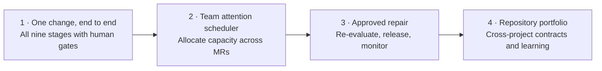

# TO BUILD A FIRE

[English](README.md) · [Español](README.es.md) · [Technical README](TECHNICAL_README.md)


When people and coding agents can open more merge requests than a team can carefully inspect, another stream of automated review comments can add to the queue. TO BUILD A FIRE is a project idea for directing review effort: gather evidence about a change, identify what remains unresolved, and show people where their judgment matters most.

> **Project status:** the local routing core and project test job are present; live GitLab execution is not yet verified. End-to-end Duo automation, real MR evidence, protected approvals, Cloud Run deployment and monitoring are the Path B/Assisted Level 1 target, not completed features. See [`docs/hackathon-path-b.md`](docs/hackathon-path-b.md).

## The problem

The number of proposed changes can grow faster than human review capacity. Diff size alone is a poor guide: a generated lockfile may span hundreds of lines, while a two-line authorization change may alter who can access sensitive data.

Sending every change to another AI reviewer can leave reviewers with the original diff plus more comments, summaries, and findings to assess. Teams need a way to see what changed, which important properties may have been affected, what evidence exists, and what still needs a person.

## What it does

TO BUILD A FIRE is an **attention router for merge requests**. It allocates finite human review capacity to the changes where consequential uncertainty remains, and shows the reasons, locations, minutes demanded, and work left beyond capacity. A versioned `Review Package` is the internal contract that carries evidence between components; it is not the product. The system does not treat an agent's confidence or a single risk score as proof.

**Agents produce observations. Verification produces bounded evidence. Policy routes attention. Humans resolve what remains consequential and uncertain.**



The router has three explainable attention routes:

| Route | Meaning |
| --- | --- |
| `COVERED_BY_EVIDENCE` | Declared claims have the evidence required by the stated policy. This does not mean “safe” and does not authorize a merge. |
| `TARGETED_REVIEW` | Specific consequential claims remain uncertain; the router shows the exact claims, evidence gaps, and locations to inspect. |
| `DEEP_REVIEW` | Impact is broad, contradictory, or too uncertain for a narrow review; a person needs to assess the change more fully. |

Evidence states such as `SUPPORTED`, `UNRESOLVED`, `CONTRADICTED`, and `NOT_RUN` describe what checks established. They are separate from attention routes. Explicit merge or release gates are a separate policy decision. The current local core enforces declared path scope and exact-revision checks. GitLab CI is configured to run the project checks, but it is not yet connected to live MR evidence or a trusted decision gate.

## A useful distinction

Consider two changes:



Line counts can help describe the diff, but they do not establish how much review it needs. The system should report **evidence-covered surface** and **unresolved review surface** separately. A portion that is not currently flagged for human review must not be described as safe merely because it was summarized or classified as mechanical.

## What makes the approach different

| Typical review queue | TO BUILD A FIRE (proposed) |
| --- | --- |
| Sort or prioritize by diff size, labels, or a single score | Explain attention needs through affected claims, policy, and evidence |
| Aggregate automated comments for a person to read | Gather evidence first and point to unresolved locations |
| Treat a clean scan or passing pipeline as a broad signal | State exactly which checks passed and which claims they support |
| Ask an agent whether the change looks safe | Use agents to investigate; use explicit policy and evidence to route decisions |

## How it should behave

The Attention Router should tell a team how much human review is demanded, how much capacity is available, what falls beyond that capacity, and why. Each work item points to affected claims, source locations, evidence and its limits, policy, and the source of its time estimate. If the estimate is unsupported, the demand is `UNKNOWN`, not zero. Candidate claims from agents stay candidates until corroborated or adjudicated.

For example, a team with 180 review minutes and 267 minutes of estimated demand sees 180 minutes scheduled and 87 still uncovered. “Scheduled” describes capacity allocation; it does not mean the code is evidence-covered or safe. These figures illustrate the intended display and are not measured project results.

```text
Review capacity today: 180 min
Estimated demand:      267 min
Scheduled:             180 min
Still uncovered:        87 min

Within capacity                 Still needing attention
MR !82   auth       35 min       MR !109  auth       42 min
MR !91   payments   50 min       MR !114  payments   45 min
MR !77   infra      40 min
MR !103  API        25 min
MR !66   deps       30 min
                         ───                           ───
                         180                            87 min
```



## Hackathon direction

The planned evaluation uses seeded changes and benign controls: generated diffs, dependency updates, formatting-only refactors, missing tests, two-line authorization widening, removed scanners, weakened assertions, reduced coverage thresholds, and CI commands ending in `|| true`. The initial inventory is in [`evaluation/corpus.json`](evaluation/corpus.json), with executable contract checks in `tests/`. It measures critical cases routed to people, unnecessary benign escalations, minutes of human review against a declared baseline, and unsupported conclusions. The target for unsupported candidate promotions is zero; no product-level metrics have been measured yet.

The planned demonstration contrasts a large, mostly generated change with a tiny authorization change, then shows the attention demand against team capacity. It should show how evidence and protected claims affect routing, rather than claim that the system has already reduced review time.

The target demo maps one connected MR flow across all nine post-code lifecycle stages. The coverage table and evidence required for each are in the [Path B / Assisted build contract](docs/hackathon-path-b.md#nine-stage-coverage-contract). This is a target, not a claim that the integrations already run.

The concept maps to the post-code lifecycle the GitLab Transcend hackathon asks participants to explore:



These stages describe the intended direction, not completed integrations. GitLab Duo Agent Platform use is a hackathon requirement and remains to be implemented.

## Repository map

- `README.md` — project overview and intended behavior.
- `README.es.md` — Spanish version of the overview.
- `TECHNICAL_README.md` — proposed architecture, decision boundary, evidence model, and open questions.
- `TODO.md` — complete product destination, build levels, inherited invariants, and closure criteria.
- `docs/hackathon-path-b.md` — end-to-end Assisted path, lifecycle evidence map, access dependencies, and Path B submission proof.
- `.gitlab-ci.yml` — current local contract test job; it is not a Duo flow or merge/deploy gate.
- `.gitignore` — local Python environments, caches, build output, and secrets.
- `visual/` — project banner and future visual assets.
- `docs/red-team/` — adversarial design reviews and their evidence.
- `LICENSE` — MIT License, copyright © 2026 Anna Tchijova.

## Next steps

The product is planned as a set of complete, connected levels. Each level is useful on its own and keeps the evidence, policy, and authority boundaries needed by the full system. The levels below describe the destination and a build path toward it; they are not claims about what this repository already implements.



| Level | Complete, useful state |
| --- | --- |
| **1. One change, end to end** | Run one real GitLab MR across all nine post-code stages, with GitLab Duo, evidence-bound routing, human checkpoints, protected release, Cloud Run deployment, and monitoring. |
| **2. Team attention scheduler** | Allocate a shared review budget across MRs, expose the cutoff, and show consequential work still unreviewed. |
| **3. Approved repair and re-evaluation** | A bounded repair becomes a separately reviewed revision with fresh evidence, release/deploy gates, and monitoring linked to the original decision. |
| **4. Repository portfolio** | Teams can apply compatible policies across related repositories, account for cross-project contracts and dependencies, and compare measured review effort and outcomes. Any tuning remains explainable and cannot silently weaken required evidence or policy. |

The complete destination is a portfolio-aware attention system that follows a change from proposal through post-deploy evidence, directs human judgment to unresolved consequential claims, and records why each action was allowed, routed, or stopped. A hackathon deadline changes how many levels we attempt; it does not change the completion bar or make an unfinished level disposable. See the [Technical README](TECHNICAL_README.md#destination-and-build-levels) for level boundaries, completion evidence, and invariants inherited from the first level.

The implementation language is Python. The project is licensed under the MIT License; see [LICENSE](LICENSE).

### Local router core

The CLI accepts an untrusted, bounded `tbaf.review-input/v1` JSON record and a separately supplied `tbaf.policy/v1` file, then emits a deterministic, SHA-256-addressed internal receipt. Changed files outside declared claim scope and stale candidates route to deep review. Candidate observations cannot clear policy-mapped claims; required checks must be reported as passing on the exact head revision before declared scope can be marked covered. Unknown effort stays unknown. The policy must come from a trusted, protected location; the current CLI does not authenticate check producers or artifact references, so its receipt only evaluates supplied records.

```bash
python -m pip install -e .
tbaf-route examples/review-input.json --policy examples/policy.json
```

This local contract is an early single-MR core, not a GitLab integration, merge gate, safety verdict, or measured reviewer-time reduction.
See [TODO.md](TODO.md) for the build plan and level completion criteria.
