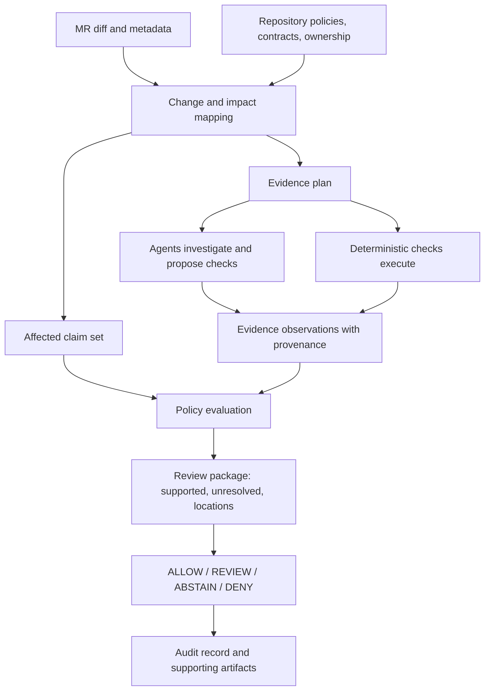

# TO BUILD A FIRE — Technical README

This document describes a proposed system. There is no implementation in this repository yet; all components, formats, policies, and outcomes below are design targets, not verified behavior.

[English](README.md) · [Español](README.es.md) · [Technical README](TECHNICAL_README.md)

## System boundary

TO BUILD A FIRE is intended to prepare an evidence package for a merge request and route human attention according to affected claims, repository policy, and unresolved consequences. It is not a general-purpose code reviewer and does not establish correctness or safety from the absence of findings.

The conceptual input set is a merge request diff plus repository context such as tests, contracts, dependency metadata, CODEOWNERS, scanner results, pipeline state, protected paths, and declared claims. External facts must retain their source and version so a reviewer can see what each decision used.

## Proposed processing model

The conceptual processing stages are:

1. **Map the change.** Identify changed files, generated or mechanical regions, behavior changes, dependencies, and affected interfaces. This stage produces candidates, not trusted conclusions.
2. **Identify claims.** Resolve which repository-declared properties may be affected. Claims should be versioned and scoped to a component or interface.
3. **Plan evidence collection.** Select tests, scanners, contract checks, ownership rules, and other checks based on affected claims and policy.
4. **Collect observations.** Record command or service, version, input revision, exit status, artifact reference, and limitations for every check.
5. **Evaluate policy.** A deterministic policy evaluator decides whether the required evidence exists and whether an explicit rule was violated.
6. **Package attention.** Present the decision, evidence, unresolved claims, and exact review locations with links back to source artifacts.

## Claim and evidence model

A claim is a repository property that a change may affect. Example: “unauthenticated users cannot read project metadata.” A claim is not proven merely because an agent mentions it or a related test passes. Each claim needs a declared scope and a policy specifying which evidence is required.

An evidence record should minimally identify:

| Field | Purpose |
| --- | --- |
| `subject` | Claim, file range, dependency, or policy the observation concerns. |
| `source` | Test, scanner, pipeline job, agent report, owner rule, or other origin. |
| `revision` | Commit and relevant configuration version used. |
| `result` | Passed, failed, not run, inconclusive, or unavailable. |
| `artifact` | Immutable or content-addressed reference to logs, reports, or outputs. |
| `scope` | What the observation actually covers. |
| `limitations` | Known gaps such as untested roles, paths, or environments. |

The review package must keep these concepts distinct:

- **Evidence-covered surface:** claims for which required, scoped evidence was collected.
- **Unresolved review surface:** claims or consequences for which evidence is missing, conflicting, or insufficient.
- **Unchanged surface:** areas for which the system has a supported basis to say the change did not affect them.

Summarizing or collapsing lines does not make a region evidence-covered. “No finding” means only that a particular check returned no finding within its stated scope.

## Decision semantics

The proposed result is a small set of explainable states:

| State | Proposed condition |
| --- | --- |
| `ALLOW` | Every required affected claim has the evidence required by the applicable policy, with no blocking rule violation. |
| `REVIEW` | Policy explicitly requires a person, or an unresolved consequence needs human judgment. |
| `ABSTAIN` | Inputs, evidence, or mapping are insufficient or contradictory; no supported conclusion can be made. |
| `DENY` | A declared prohibition is violated, such as an unauthorized edit to protected policy. |

The evaluator must expose the policy rule and evidence that led to the state. An agent confidence value must not override missing required evidence. Whether `ALLOW` can ever trigger a merge is a separate policy decision and remains open; the initial demonstration should not enable autonomous production merges.

## Agent role and trust boundary

Agents may map changes, find candidate claims, propose relevant tests, identify suspicious call paths, draft repairs, and summarize evidence. Agent output is an untrusted observation: it can be incomplete, mistaken, or contradicted. It must not edit the policy that authorizes it, convert its own claim into proof, or silently change the decision rules.

Tests, scanners, and policy checks are also bounded evidence sources. Their existence does not establish effectiveness. The system must record versions and inputs and state what each check covered. A green pipeline is not a universal correctness claim.

The policy evaluator is the intended decision boundary. It should be deterministic for a fixed policy, input revision, and evidence set. The exact implementation and serialization format have not been selected.

## Human attention package

The output should answer, in order:

1. What changed in behavior and scope?
2. Which declared claims may be affected?
3. What checks ran, and what did each actually establish?
4. Which claims remain unresolved or conflict?
5. Where should a reviewer look, and what expertise does the issue call for?
6. Which policy rule produced the routing outcome?

Line counts may be included as descriptive metadata. They must not be used as a substitute for claim impact or evidence coverage.

## Proposed GitLab lifecycle mapping

| Stage | Intended project activity |
| --- | --- |
| Plan | Classify the change and build an evidence plan. |
| Create | Agent proposes a repair for a mechanically repairable gap. |
| Verify | Run tests, contracts, invariants, and pipeline checks. |
| Package | Assemble the review package and linked evidence artifacts. |
| Secure | Run security checks and assess affected security surfaces. |
| Release | Apply an explicit release or merge policy gate. |
| Configure | Carry deployment configuration and policy context forward. |
| Monitor | Collect post-deploy health signals and regressions. |
| Govern | Record evidence, policy versions, decisions, and human approvals. |

This is a target lifecycle map, not a claim that each stage is implemented or integrated. A monitor signal may reopen assessment, but rollback behavior and deployment authority are undecided.

## Destination and build levels

### Destination

The intended end state is a portfolio-aware system for directing review attention across related repositories and the post-code lifecycle. For each proposed change, it maps affected behavior to repository-declared claims, collects attributable evidence, applies explicit policy, and routes unresolved consequential questions to the right human. It can support bounded repairs and gated release actions, then use post-deploy signals to reopen assessment. It preserves a decision record linking the change revision, policy version, checks, agent observations, human actions, and final outcome.

The destination is not “merge more changes automatically.” Its completion condition is that teams can account for consequential changes from proposal through monitored release, understand the evidence behind each routing outcome, and measure where human review effort went without treating reduced line count as proof of safety.

### Level sequence

Levels are product states, not technical workstreams. Each completed state must remain useful if later work stops. The next state extends the prior system through stable claim, evidence, policy, and decision records rather than replacing them.

| Level | Boundary and user value | Completion evidence |
| --- | --- | --- |
| **1 — Evidence-backed MR package** | One repository and one MR at a time. A reviewer receives changed behavior, affected declared claims, scoped check results, unresolved questions, exact source locations, and an explainable routing outcome. GitLab Duo agents investigate and propose evidence; deterministic checks and a deterministic policy evaluator supply the decision boundary. The team can use this package directly in review. | Demonstrate paired large/mechanical and small/authorization changes. Show evidence provenance and scope, the required human route for the unresolved authorization claim, and `ABSTAIN` when evidence is missing or stale. A reviewer can inspect all source artifacts from the package. |
| **2 — Team attention queue** | Multiple MRs and repository policies are visible together. The system orders work by unresolved consequences, ownership/expertise, and declared reviewer capacity, then tracks human corrections and dispositions. Level 1 remains available as the complete per-MR view. | Demonstrate a queue where a large, bounded change does not automatically outrank a small consequential one; show the routing reasons, owner source, reviewer correction, and retained per-MR evidence packages. |
| **3 — Governed change lifecycle** | The team can authorize bounded agent repairs, re-run relevant evidence, package and gate a release, carry policy into deployment configuration, and observe post-deploy health. Human approval requirements and agent permissions are explicit. Regressions reopen assessment with links to the deployed revision and originating evidence. | Demonstrate a repair proposal through verification and an approval-gated release path, plus a post-deploy regression that reopens review. Show that an agent cannot alter the policy that constrains its action. |
| **4 — Repository portfolio** | Related repositories share compatible, versioned policy and claims. The system accounts for dependencies and contracts across projects and compares review effort and decision outcomes over time. It may suggest policy or workflow improvements, but cannot silently tune away requirements. | Demonstrate a cross-repository change or contract impact, trace decisions to the policies and evidence for each affected repository, and report a defined review-effort measure alongside its scope and limitations. |

The hackathon build horizon should be set by choosing the highest whole level that can be completed with its completion evidence. If time ends partway through a level, report the preceding completed level and the unfinished work accurately. Do not call partial wiring a completed level or discard a useful prior level to broaden feature coverage.

### Invariants inherited from Level 1

These properties are requirements for every level that handles a change; later levels may strengthen them but must not bypass them:

1. **Agent output is input, not authority.** Agents may investigate or propose actions. They cannot set the final policy result, authoritatively prove their own claims, or change the rules that constrain them.
2. **Evidence is scoped and attributable.** Every observation is tied to the exact code revision and relevant policy/check version, with its source, result, artifact, scope, and limitations. Stale, absent, conflicting, or out-of-scope evidence cannot count as a pass.
3. **Uncertainty stays visible.** `ABSTAIN` is a valid outcome. Missing evidence is not a clean result, and summaries or collapsed lines are not evidence of safety.
4. **Policy is explicit and protected.** The evaluator explains which versioned rule produced the outcome. A change cannot grant itself authority by modifying the policy used to approve it.
5. **Human authority is recorded.** Required approvals, reviewer corrections, and release decisions identify the actor and decision context. Automation cannot imply approval from silence unless a separately declared policy explicitly grants that authority.
6. **Records remain linked across transitions.** Evidence packages and decisions retain identifiers for the source change, policy version, and downstream release/deployment revisions so monitoring and governance can trace outcomes back to the reviewed change.
7. **Claims stay bounded by evidence.** A check supports only the properties and inputs it actually covers. No global “safe” result may be inferred from a passing pipeline, a clean scanner, an agent confidence score, or fewer lines for review.

These invariants are part of the product boundary from the first useful level, not a later hardening phase. Exact storage, access control, integrity mechanism, and retention guarantees remain design decisions; the documentation does not claim they exist yet.

## Failure and abstention cases

The system should abstain or require review when the diff cannot be mapped reliably; required checks did not run; evidence refers to a different commit; policy is missing or contradictory; agent findings conflict with deterministic evidence; or impact reaches an undeclared protected surface. A missing scanner result must not be treated as a clean result.

Explicitly prohibited operations should produce `DENY` only when the applicable rule and evidence are clear. Uncertainty about whether a rule applies is an abstention or review condition, not a fabricated violation.

## Open design decisions

- Boundary and supported repository languages of the first complete level.
- Claim schema, policy authoring format, and policy versioning.
- GitLab Duo Agent Platform integration and required permissions.
- Evidence artifact format, retention, and integrity properties.
- Which checks can run in the hackathon environment and how their scope is recorded.
- Whether routing can affect merge state or only recommend reviewer actions.
- Reviewer assignment model and how expertise/availability data is sourced.
- Evaluation method for attention reduction without implying safety from fewer lines.

## Decisions made

- **Implementation language: Python.** The supported repository languages of the first complete level remain to be scoped separately.
- **Project license: MIT.** Copyright attribution is recorded as Anna Tchijova in the root [LICENSE](LICENSE).

## Validation needed before product claims

The proposed demo should use paired examples: a large generated or mechanical diff with bounded checks, and a small change that crosses an authorization boundary. Evaluation should verify that the output names the evidence and its scope, routes the security-sensitive unresolved claim to a human, and abstains when required evidence is absent. Any claim about reduced effort needs a measured baseline and a defined review-time or attention metric.

No implementation, tests, benchmarks, or measured outcomes are present yet.
