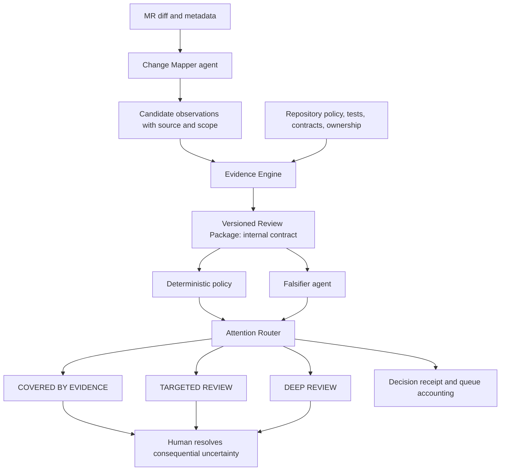

# TO BUILD A FIRE — Technical README

This document describes the intended system and distinguishes current behavior. The repository contains a Python input contract, deterministic local attention router, read-only MR snapshot, bounded authorization invariant check, and SHA-bound linker for structured Duo candidate assessments. GitLab Duo has been exercised on live MRs with human approval before internal notes are posted. The linker and its default-branch CI job are being reviewed in GitLab MR !8; a live default-branch run is still needed to verify job-token access to MR notes. Arbitrary caller-supplied checks remain unauthenticated by the local CLI.

[English](README.md) · [Español](README.es.md) · [Technical README](TECHNICAL_README.md)

## System boundary

TO BUILD A FIRE is an attention allocation system for teams whose incoming changes exceed their human review capacity. It routes human work according to consequential uncertainty, available capacity, affected claims, repository policy, and evidence. It is not a general-purpose code reviewer and does not establish correctness or safety from the absence of findings. A `Review Package` is its versioned internal integration contract, not the product or its user-facing decision.

The governing separation is: **agents produce observations; verification produces bounded evidence; policy routes attention; humans resolve what remains consequential and uncertain.**

The conceptual input set is a merge request diff plus repository context such as tests, contracts, dependency metadata, CODEOWNERS, scanner results, pipeline state, protected paths, and declared claims. External facts must retain their source and version so a reviewer can see what each decision used.

## Proposed processing model

The conceptual processing stages are:

1. **Map the change.** The Change Mapper identifies changed files, generated/mechanical regions, possible behavior changes, dependencies, and affected interfaces. Every semantic assertion is a `CANDIDATE` observation with agent identity, source revision, scope, and input pointer.
2. **Gather bounded evidence.** Tests, CI, scanners, contracts, ownership, and repository policy contribute observations tied to the relevant commit and tool/configuration version. `NOT_RUN` and `UNAVAILABLE` are distinct from a passing check.
3. **Challenge candidate claims.** A Falsifier agent attempts to find counterexamples or missed impact. Its output remains a candidate observation; repeating a claim through another agent does not promote its epistemic status.
4. **Build the Review Package.** The versioned package links candidate claims, bounded observations, policy, exact source locations, limitations, and human attention tasks. It is the shared internal contract; interfaces do not recalculate it.
5. **Apply policy and route attention.** Deterministic policy evaluates declared evidence requirements. The Attention Router assigns work to an attention route, attaches its reasons, and compares estimated demand with declared human capacity.
6. **Record and resolve.** The human sees the demand, source evidence, unresolved consequence, and work below the capacity cutoff; their adjudication becomes a new attributable event. A route is not an implicit merge approval.

## Claim and evidence model

A claim is a repository property that a change may affect. Example: “unauthenticated users cannot read project metadata.” A claim is not proven merely because an agent mentions it or a related test passes. Each claim needs a declared scope and a policy specifying which evidence is required.

An evidence record should minimally identify:

| Field | Purpose |
| --- | --- |
| `subject` | Claim, file range, dependency, or policy the observation concerns. |
| `source` | Test, scanner, pipeline job, mapper/falsifier agent, owner rule, or other origin. |
| `epistemic_status` | `CANDIDATE`, `OBSERVATION`, or an adjudicated status, with the authority allowed to assign it. |
| `revision` | Base/head commit and relevant policy/check configuration version used. |
| `result` | `SUPPORTED`, `CONTRADICTED`, `NOT_RUN`, `UNAVAILABLE`, or `INCONCLUSIVE` for evidence observations. |
| `artifact` | Immutable or content-addressed reference to logs, reports, or outputs. |
| `scope` | What the observation actually covers. |
| `limitations` | Known gaps such as untested roles, paths, or environments. |

The review package must keep these concepts distinct:

- **Evidence-covered surface:** claims for which required, scoped evidence was collected.
- **Unresolved review surface:** claims or consequences for which evidence is missing, conflicting, or insufficient.
- **Unchanged surface:** areas for which the system has a supported basis to say the change did not affect them.
- **Candidate claims:** possible impact raised by an agent or extractor. A candidate is a reason to gather evidence or human attention, not a conclusion.
- **Human attention demand:** bounded tasks with exact locations, expertise, duration estimate, estimate source, and uncertainty. If no defensible estimate exists, duration is `UNKNOWN`, not zero.

Summarizing or collapsing lines does not make a region evidence-covered. “No finding” means only that a particular check returned no finding within its stated scope.

## Evidence state and attention route

Evidence state and attention route are separate axes. A route says how people should spend attention; it does not say whether a merge is authorized.

| Evidence state | Meaning |
| --- | --- |
| `SUPPORTED` | A named observation supports a claim within its recorded scope. |
| `UNRESOLVED` | Required evidence is absent or does not settle the claim. |
| `CONTRADICTED` | Available observations conflict or directly contradict the claim. |
| `NOT_RUN` | A required check did not execute. This is never a pass. |
| `CANDIDATE` | An agent or mapper proposed possible impact or counterevidence. It has not been adjudicated. |

| Attention route | Proposed condition |
| --- | --- |
| `COVERED_BY_EVIDENCE` | Declared claims have the policy-required evidence at the evaluated revision. It does not mean globally safe or authorize merge. |
| `TARGETED_REVIEW` | Specific consequential claims remain uncertain and can be resolved by reviewing named locations or evidence. |
| `DEEP_REVIEW` | Impact is broad, contradictory, or too uncertain for a bounded review. A human must assess the change more fully. |

The deterministic policy and router explain which rule and evidence produced the route. Explicit allow/deny actions for merge, release, or deployment are separate, versioned policy outcomes at the lifecycle level; they are not synonyms for attention routes. Agent confidence cannot override missing required evidence.

## Agent role and trust boundary

Agents may map changes, find candidate claims, propose relevant tests, identify suspicious call paths, draft repairs, and summarize evidence. Agent output is an untrusted observation: it can be incomplete, mistaken, or contradicted. It must not edit the policy that authorizes it, convert its own claim into proof, or silently change the decision rules.

Tests, scanners, and policy checks are also bounded evidence sources. Their existence does not establish effectiveness. The system must record versions and inputs and state what each check covered. A green pipeline is not a universal correctness claim.

### Bounded authorization invariant probe

The snapshot job contains a static AST interpreter for the sample `src/auth.py:can_read_record` contract. It reads the blob at the MR head SHA as bytes and never imports or executes MR code. For the supported expression subset, it checks all eight combinations of authentication, administrator status, and owner equality against the declared rule: unauthenticated callers are denied; authenticated admins and owners are allowed; authenticated non-owner, non-admin callers are denied. Unsupported syntax, a missing function, or oversized/malformed source returns `NOT_RUN` and leaves the policy claim unresolved. A counterexample returns `FAIL`, which also routes to human review.

The probe is deliberately narrow. It does not establish whether the function is imported or reachable, whether callers pass trustworthy user/record objects, or whether other authorization paths exist. A `PASS` supports only this function's behavior under the documented AST subset; it is not a repository-wide security verdict. Full scope and scenario details are in [`docs/authorization-invariant-check.md`](docs/authorization-invariant-check.md).

The policy evaluator is the intended decision boundary. It should be deterministic for a fixed policy, input revision, and evidence set. The exact implementation and serialization format have not been selected.

## Attention demand and capacity

Attention is a finite resource. Each review task carries:

- consequence/claim and unresolved reason;
- exact source range, evidence and policy links;
- expertise or owner required;
- estimated minutes, source/method and uncertainty (or `UNKNOWN`);
- route and any reviewer adjudication history.

At the individual MR level, the system presents its attention demand beside configured capacity. Queue-level scheduling sorts the task set under the declared budget, displays the cutoff and reports all consequential work below it as uncovered. It must not imply that work beneath the cutoff was reviewed. No opaque aggregate score substitutes for consequence, uncertainty, effort and capacity dimensions. Line counts remain descriptive metadata, never a proxy for attention minutes.

## Proposed GitLab lifecycle mapping

| Stage | Intended project activity |
| --- | --- |
| Plan | Classify the change and build an evidence plan. |
| Create | Agent proposes a repair for a mechanically repairable gap. |
| Verify | Run tests, contracts, invariants, and pipeline checks. |
| Package | Assemble the review package and linked evidence artifacts. |
| Secure | Run security checks and assess affected security surfaces. |
| Release | Apply an explicit release or merge policy gate. |
| Configure | Carry deployment configuration and policy context forward. |
| Monitor | Collect post-deploy health signals and regressions. |
| Govern | Record evidence, policy versions, decisions, and human approvals. |

This is a target lifecycle map, not a claim that each stage is implemented or integrated. A monitor signal may reopen assessment, but rollback behavior and deployment authority are undecided.

## Destination and build levels

### Destination

The intended end state is a portfolio-aware system for directing review attention across related repositories and the post-code lifecycle. For each proposed change, it maps affected behavior to repository-declared claims, collects attributable evidence, applies explicit policy, and routes unresolved consequential questions to the right human. It can support bounded repairs and gated release actions, then use post-deploy signals to reopen assessment. It preserves a decision record linking the change revision, policy version, checks, agent observations, human actions, and final outcome.

The destination is not “merge more changes automatically.” Its completion condition is that teams can account for consequential changes from proposal through monitored release, understand the evidence behind each routing outcome, and measure where human review effort went without treating reduced line count as proof of safety.

### Level sequence

Levels are product states, not technical workstreams. Each completed state must remain useful if later work stops. The next state extends the prior system through stable claim, evidence, policy, and decision records rather than replacing them.

| Level | Boundary and user value | Completion evidence |
| --- | --- | --- |
| **1 — One change, end to end** | One real MR crosses Plan, Create, Verify, Package, Secure, Release, Configure, Monitor, and Govern. GitLab Duo proposes; deterministic CI/policy checks provide bounded evidence; a human approves consequential transitions; the approved SHA is released to a live service and monitored. | Public GitLab flow/session and CI history, scoped checks/artifacts, human checkpoints, reproducible receipt, protected release/deploy, live endpoint and linked monitor/reopen evidence. Each of the nine stages must run and leave evidence; a configured prompt or diagram does not count. See [`docs/hackathon-path-b.md`](docs/hackathon-path-b.md). |
| **2 — Team attention scheduler** | Multiple MR tasks are ordered and assigned against real team capacity, ownership/expertise, and effort estimates. The router exposes total demand, available minutes, covered work, cutoff, and consequential work left unreviewed. Human adjudication and false-positive cost feed queue measurement without rewriting past packages. | Demonstrate capacity planning (e.g. demand greater than available minutes), transparent ordering and cutoff, assignment source, reviewer correction, dismiss rate, time-to-review by consequence band, and retained per-MR receipts. |
| **3 — Approved repair and re-evaluation** | Extend the end-to-end Level 1 flow so bounded repairs become separately reviewed revisions, each with fresh evidence and linked deployment/monitor state. The agent cannot alter policy or approve its own change. | Demonstrate a repaired SHA through fresh verification, approval-gated release, deployment and a regression that reopens the original linked review chain. |
| **4 — Repository portfolio** | Related repositories share compatible, versioned policy and claims. The system accounts for dependencies and contracts across projects and compares review effort and decision outcomes over time. It may suggest policy or workflow improvements, but cannot silently tune away requirements. | Demonstrate a cross-repository change or contract impact, trace decisions to the policies and evidence for each affected repository, and report a defined review-effort measure alongside its scope and limitations. |

The hackathon build horizon should be set by choosing the highest whole level that can be completed with its completion evidence. If time ends partway through a level, report the preceding completed level and the unfinished work accurately. Do not call partial wiring a completed level or discard a useful prior level to broaden feature coverage.

### Invariants inherited from Level 1

These properties are requirements for every level that handles a change; later levels may strengthen them but must not bypass them:

1. **Candidate is not conclusion.** Agent observations preserve `CANDIDATE`, origin, and scope. Repetition, summarization, or another agent does not promote a candidate into evidence or an adjudicated claim.
2. **Evidence is scoped and attributable.** Every observation is tied to the exact code revision and relevant policy/check version, with its source, result, artifact, scope, and limitations. Stale, absent, conflicting, or out-of-scope evidence cannot count as a pass.
3. **Uncertainty stays visible.** Missing evidence remains `UNRESOLVED` or `NOT_RUN`; contradictions remain `CONTRADICTED`. The router escalates them to targeted or deep review instead of coercing them to a pass. Summaries and collapsed lines are not evidence of safety.
4. **Policy is explicit and protected.** The evaluator explains which versioned rule produced the outcome. A change cannot grant itself authority by modifying the policy used to approve it.
5. **Human authority is recorded.** Required approvals, reviewer corrections, and release decisions identify the actor and decision context. Automation cannot imply approval from silence unless a separately declared policy explicitly grants that authority.
6. **Records remain linked across transitions.** Evidence packages and decisions retain identifiers for the source change, policy version, and downstream release/deployment revisions so monitoring and governance can trace outcomes back to the reviewed change.
7. **Claims stay bounded by evidence.** A check supports only the properties and inputs it actually covers. No global “safe” result may be inferred from a passing pipeline, a clean scanner, an agent confidence score, or fewer lines for review.

These invariants are part of the product boundary from the first useful level, not a later hardening phase. Exact storage, access control, integrity mechanism, and retention guarantees remain design decisions; the documentation does not claim they exist yet.

## Failure and abstention cases

The system should route to `DEEP_REVIEW` when the diff cannot be mapped reliably, policy is missing/contradictory, impact reaches an undeclared protected surface, or candidate findings conflict with evidence in a consequential area. It should route to `TARGETED_REVIEW` when a bounded claim needs a specific check or human judgment. A missing scanner result remains `NOT_RUN`; it must not be treated as clean. If no defensible duration exists for a task, its attention demand remains `UNKNOWN`.

An explicit merge/deploy prohibition is a separate policy gate outcome, recorded alongside the attention route. `DENY` is emitted only when the applicable rule and evidence are clear. Uncertainty about whether a rule applies remains a review condition, not a fabricated violation.

## Open design decisions

- Boundary and supported repository languages of the first complete level.
- Claim schema, policy authoring format, and policy versioning.
- GitLab Duo Agent Platform integration and required permissions.
- Evidence artifact format, retention, and integrity properties.
- Which checks can run in the hackathon environment and how their scope is recorded.
- Whether routing can affect merge state or only recommend reviewer actions.
- Reviewer assignment model and how expertise/availability data is sourced.
- Method for estimating human review minutes, calibration population, and uncertainty bounds.
- Evaluation method for attention reduction without implying safety from fewer lines.

## Decisions made

- **Implementation language: Python.** The supported repository languages of the first complete level remain to be scoped separately.
- **Project license: MIT.** Copyright attribution is recorded as Anna Tchijova in the root [LICENSE](LICENSE).

## Validation needed before product claims

The proposed evaluation corpus includes generated and dependency diffs, formatting-only refactors, missing tests, a two-line authorization widening, a removed scanner, weakened assertions, reduced coverage thresholds, a CI `|| true` change, and benign controls. Report critical cases routed to human attention, benign escalation rate, human review minutes against a declared baseline, and unsupported candidate promotions. The target for unsupported candidate promotions is zero; these are evaluation goals, not measured results. Any claim about reduced effort needs the baseline and the actual review-time/attention metric.

The local contract and router are implemented under `src/tbaf/`; mutation-oriented checks are under `tests/`, with the scenario inventory in `evaluation/corpus.json`. Live GitLab pipelines have exercised the MR snapshot path and bounded authorization check; for evidence and scope limits see [`docs/live-evidence-2026-10-09.md`](docs/live-evidence-2026-10-09.md). The seeded authorization check returned `FAIL` inside a successful snapshot job, leaving the claim unresolved and routed to human review. These pipelines do not constitute a merge/deploy authorization, deployment, or monitoring path. The former illustrative Review Package artifact was removed so example input cannot be mistaken for an MR receipt. See [`docs/hackathon-path-b.md`](docs/hackathon-path-b.md) for the end-to-end Path B/Assisted contract and its nine-stage evidence requirements. No benchmarks or measured review-time outcomes are present yet.
